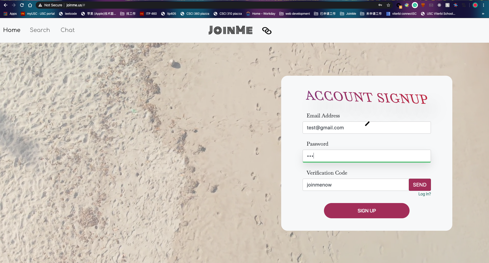
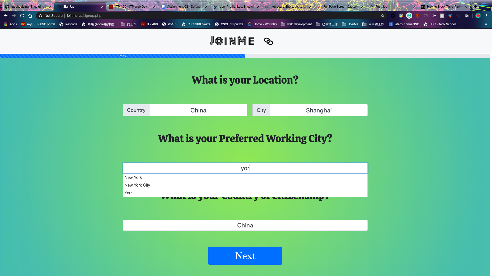
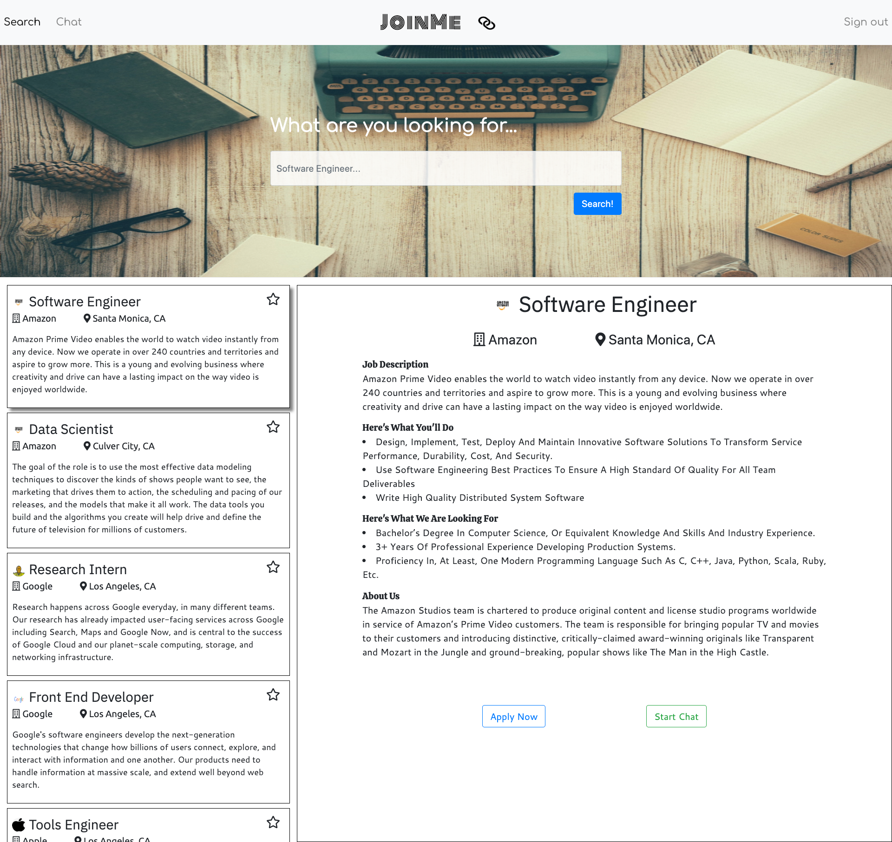
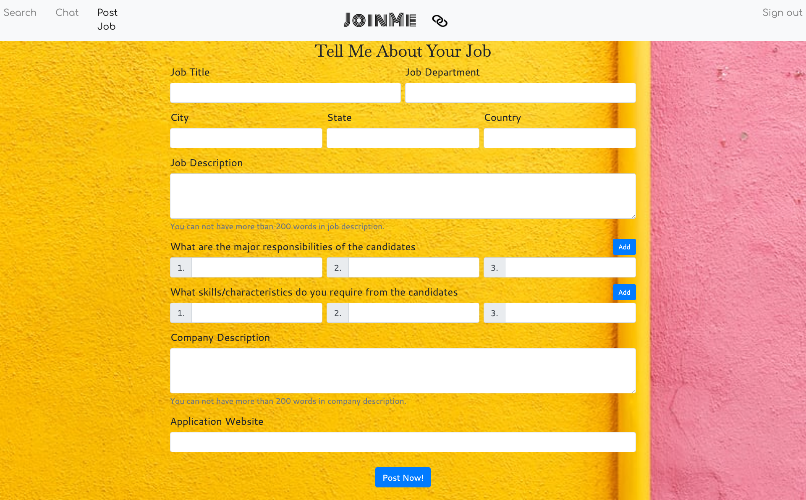
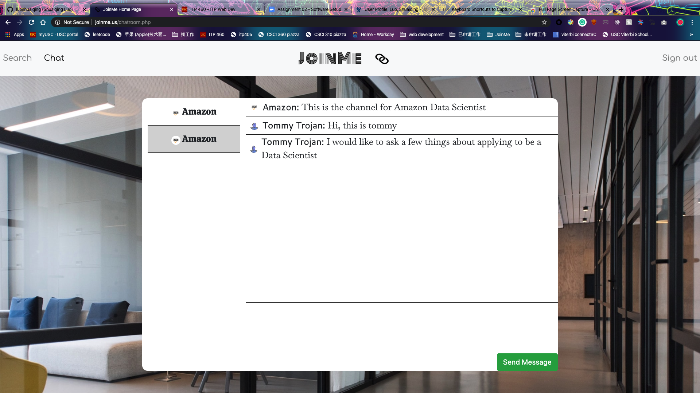

# JoinMe
This is an Employment Marketplace for Job Seekers and Employers that supports direct chatting between the two.
## Key functionalities: 
* chatting
* email verification
* autocomplete
* login / signup
* keyword searching
* page transition effect 
## Key technologies:
* SCSS
* NPM
* Session
* PHP
* jQuery
* jQuery UI
* Media Queries
* JavaScript
* CSS
* HTML5

The following screenshots are some of the pages:

(The photos can also be seen in [ScreenShots](screenshots) folder.

Please checkout *www.joinme.us* for more details.

Please use the following accounts to test my project or feel free to sign up yourself. (The verification code is joinmeus and is already prefilled in the signup page)

For signup page, I have already prefilled in some information to save you some time. Whatever information I didnot fill in is expected to really show up on some pages, so please fill them up yourself.

Author: **Shuaiqing Luo**

